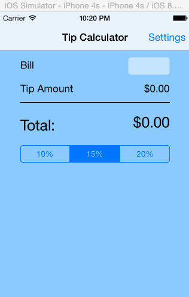

This is an IOS demo application for tip calculation as shown in the following [video](http://vimeo.com/74764846)

Time spent: 5 hours spent in total

Completed user stories:

* [x] Required: The tip calculation application
* [x] Optional: A settings page view that set the deafult tip persentage.

Notes:

Spent some time making the UI work across multiple phone resolutions by playing around with the RelativeLayout.

Walkthrough of all user stories:

GIF created with [LiceCap](http://www.cockos.com/licecap/).

It was fun :-) even that is new dev methodology.